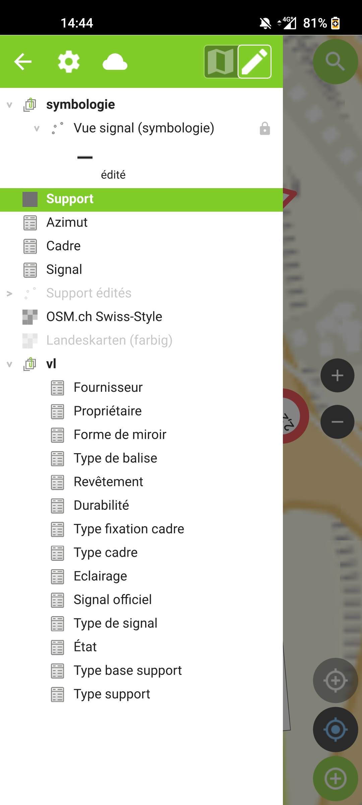

### Utilisation de Signalo sur QGIS

Ouvrir le projet se trouvant dans le zip, voir [installation](installation.md), dans QGIS.

#### Ajout de signaux

* Editer la couche "Support"
* Le formulaire et composé de trois onglets "Général", "Azimut" et "Photo"

* Dans l’onglet “Azimut” ajouter l’azimut de la signalisation
* Un formulaire “Azimut” s’ouvre, y ajouter les azimuts liés au support
* Par azimut ajouter les cadres
* Par cadre ajouter les signaux

La structure de la signalisation donne les possibilités suivantes :

* *Un support peut contenir plusieurs azimuts*
* *Un azimut peut contenir plusieurs cadres*
* *Un cadre peut contenir plusieurs signaux*

Ci-dessous un exemple de structure :

### Utilisation de Signalo sur QField

* Utiliser le plugin “QFieldSync” pour paqueter le projet pour QField
* Le dossier se compose d'un projet QGIS (qgs) et d'un fichier de base de données (gpkg)
* Ajouter le dossier “images” à ce dossier. Ceci permet d'avoir un rendu avec les images de la signalisation.
* Copier ce dossier sur votre appareil mobile à l'emplacement de votre choix
* Ouvrir QField ⇒ cliquer sur “Ouvrir un fichier local”
* Chercher le fichier qgs copié en local sur votre mobile

{ width="300"}

Une fois le projet ouvert, démarrer l'édition des supports.

{ width="300"}

Editer le formulaire du support afin d'y ajouter les signaux.

{ width="300"}

De retour au bureau, synchroniser le projet à l'aide de QFieldSync