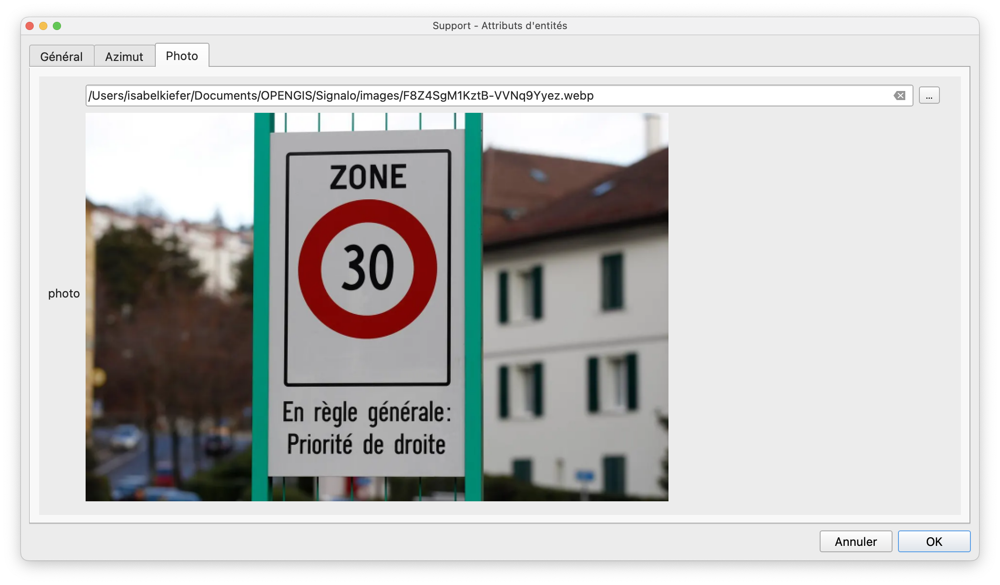
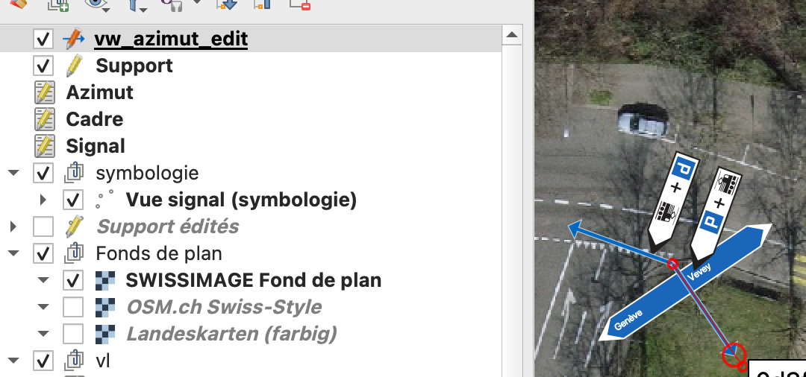

## Edition

### Ajout de signaux

* Mettre la couche "Support" en édition et digitaliser un point pour ouvrir le formulaire.

!!! info "Le formulaire est composé de trois onglets:"

    === "Général"
        <figure markdown>
          { width="500"; loading=lazy }
          <figcaption>Onglet général</figcaption>
        </figure>

    === "Azimut"
        <figure markdown>
          { width="500"; loading=lazy }
          <figcaption>Onglet azimut</figcaption>
        </figure>

    === "Photo"
        <figure markdown>
          { width="500"; loading=lazy }
          <figcaption>Onglet photo</figcaption>
        </figure>

Dans l’onglet “Azimut”, les cadres et signaux peuvent y être saisis. L'attribut *Azimut* peut être rempli de manière graphique, grâce à la vue `vw_azimut_edit` du schéma `signalo_app`.

<figure markdown>
  { width="500"; loading=lazy }
  <figcaption>Exemple d'un azimut avec plusieurs cadres et signaux</figcaption>
</figure>

<figure markdown>
  { width="500"; loading=lazy }
  <figcaption>Définition de l'azimut de manière graphique, grâce à la vue vw_azimut_edit</figcaption>
</figure>

## Taille des panneaux

La taille des panneaux peut être ajustée dans les propriétés du projet, dans l'onglet `Variables`, en modifiant la variable `signalo_img_size`.

<figure markdown>
  { width="500"; loading=lazy }
  <figcaption>Réglage de la taille de l'image</figcaption>
</figure>

## Décalage des panneaux

En cas de supports portant de nombreux signaux, la visibilité des signaux sur la carte peut être améliorée avec les attributs `offset_x` et `offset_y` de la table `azimut` (attributs *décalage X* et *décalage Y* de la couche *Azimut* dans QGIS).

## Panneaux spéciaux
### Panneaux directionnels

Le modèle des données permet une gestion fine des panneaux directionnels. Trois attributs définissent l'affichage de ces panneaux:

* Dans la table `vl_official_sign` (couche *Signal officiel* dans le projet QGIS), l'attribut boolean `directional_sign` définit si un signal est un signal directionnel ou non.
* Dans la table `frame`, l'attribut `anchor` permet de définir le point d'ancrage du cadre: *Gauche*, *Centré* ou *Droite* (couche *Cadre* avec l'attribut *point d'ancrage* dans le projet QGIS).
* Dans la table `sign`, l'attribut boolean `natural_direction_or_left` permet de changer la direction naturelle du panneau par rapport à son point d'ancrage défini au niveau du cadre. Par défaut (la case est cochée), la direction du panneau sera à l'opposé de son point d'ancrage. C'est-à-dire, si le point d'ancrage est à droite, le panneau pointera à gauche et vice-versa. Cet automatisme peut être contourné en décochant la case *direction naturel ou gauche*.

### Panneaux recto-verso

Au niveau du signal, (table `sign`, couche *Signal* dans QGIS) l'attribut `hanging_mode` ou *mode d'accrochage* permet de définir si un panneaux porte le même signal des deux côtés.

* *VERSO* -> le signal n'est affiché que d'un côté
* *RECTO-VERSO* -> le signal est affiché des deux côtés du panneau
* *RECTO* -> le signal n'est affiché que dans le dos du panneau. Cette valeur peut être choisi p.ex. quand le recto et le verso du panneau ne sont pas identiques.

* A noter: la couche **cadre** contient également un attribut lié au recto-verso (case à cocher **montage recto-verso**). La valeur de cet attribut n'est néanmoins qu'informative, elle n'aura aucune influence sur l'affichage du panneau sur la carte.*

### Signaux définis par l'utilisateur

Il arrive qu'une certaine composition de signaux sur un même panneau n'existe pas dans la sélection des signaux officiels. La table `vl_user_sign` (couche *Signal défini par l'utilisateur* dans QGIS) permet la création de signaux personnalisés. Cette table contient les mêmes attributs que `vl_official_sign`, la liste des signaux officiels. Au minimum, les attributs suivants doivent être renseignés:

* `id` - identifiant unique qui sera utilisé dans la liste déroulante dans QGIS
* `active` - à mettre sur *true*, autrement le signal n'apparaîtra pas dans la liste déroulante dans QGIS
* `value_fr`, ou `value_de` ou `value_it`, en fonction de la langue utilisateur - ce nom apparaîtra également dans la liste déroulante dans QGIS
* `img_fr` ou `img_de` ou `img_it`, en fonction de la langue de l'utilisateur. Cet attribut doit contenir le nom exact du fichier `.svg` du signal personnalisé
* `img_height` et `img_width` - deux valeurs qui contiennent la hauteur et la largeur de l'image `.svg`

Les attributs suivants permettent en outre de créer et gérer des panneaux directionnels personnalisés:

* `directional_sign` - à mettre sur true s'il s'agit d'un panneau directionnel
* `img_fr_right`, `img_de_right`, `img_it_right`, `img_ro_right`, qui contiendront le nom du fichier `.svg` avec direction à droite, par exemple *composite-r.svg*. Les attributs `img_fr`, `img_de` etc. contiendront alors le nom du fichier `.svg` avec direction à gauche, par exemple *composite-l.svg*.

Afin d'accéder à la liste déroulante des signaux définis par l'utilisateur dans QGIS, le **type de signal** *défini par l'utilisateur* doit être choisi.

<figure markdown>
  { width="500"; loading=lazy }
  <figcaption>Liste des types de signal</figcaption>
</figure>

La création du `.svg` correspondant est donc dans la responsabilité de l'utilisateur. Le fichier d'image doit être enregistré dans les deux dossiers

* project > images > user-defined > original : ceci est l'image non-dynamique qui sera aussi affichée dans le formulaire d'attributs
* project > images > user-defined > editable : ceci est l'image dynamique qui permet d'afficher des inscriptions

Il est recommandé de prendre une des images officielles comme exemple et base pour créer un signal personnalisé, afin d'avoir une idée de la taille et pour comprendre comment configurer les inscriptions dynamiques.

<figure markdown>
  { width="200"; loading=lazy }
  <figcaption>Emplacement des fichiers `.svg` des signaux définis par l'utilisateur</figcaption>
</figure>

## Environnements de travail

Vous avez la possibilité d'avoir plusieurs environnements de travail: test, production, …
Plusieurs fichiers projets sont disponibles avec chaque version:

| Fichier projet | nom du service PG     | exemple d'utilisation |
| ------------- | ---------------------- | --------------------- |
| `signalo.qgs` | `pg_signalo`           | demo                  |
| `signalo_prod.qgs` | `pg_signalo_prod` | production            |
| `signalo_dev.qgs` | `pg_signalo_dev`   | test et développement |

## Langues

Un système de traduction du projet QGIS a été mis en place. Les fichiers de traduction `signalo_XX.qm` doivent se situer dans le dossier du projet QGIS. Le projet `signalo.qgs` s'ouvre alors dans la langue du profil de l'utilisateur QGIS. Pour le moment, le projet existe en français (langue *master*) et en allemand (avec le fichier de traduction `signalo_de.qm`). Si la langue du logiciel est l'allemand, un fichier de projet `signalo_de.qgs` se créera alors automatiquement à l'ouverture du projet `signalo.qgs`.

## Filtrage et analyse de la cohérence globale

Cette fonctionnalité devrait être [améliorée](roadmap.md) dans les versions suivantes.

Il est possible de filtrer l'affichage des panneaux au moyen de la couche "Vue filtrage".
Avec un clic-droit sur la couche, sélectionner "Filtrer…" dans le menu.
Il faut alors construire une requête pour filtrer les éléments.

<figure markdown>
  { width="500"; lazy-loading }
  <figcaption>Filtrage des signaux</figcaption>
</figure>
