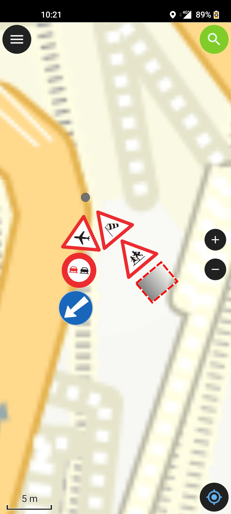

* Utiliser le plugin “QFieldSync” pour créer un paquet projet pour QField
* Le dossier se compose d'un projet QGIS (qgs) et d'un fichier de base de données (gpkg)
* Ajouter le dossier “images” à ce dossier. Ceci permet d'avoir un rendu avec les images de la signalisation.
* Copier ce dossier sur votre appareil mobile à l'emplacement de votre choix
* Ouvrir QField ⇒ cliquer sur “Ouvrir un fichier local”
* Chercher le fichier qgs copié en local sur votre mobile

<figure markdown>
  { width="300" align="left"; loading=lazy }
  <figcaption>visualisation sous QField</figcaption>
</figure>
<figure markdown>
  { width="300" align="left"; loading=lazy }
  <figcaption>édition des supports</figcaption>
</figure>
<figure markdown>
  { width="300" align="left"; loading=lazy }
  <figcaption>édition du formulaire</figcaption>
</figure>

De retour au bureau, synchroniser le projet à l'aide de QFieldSync