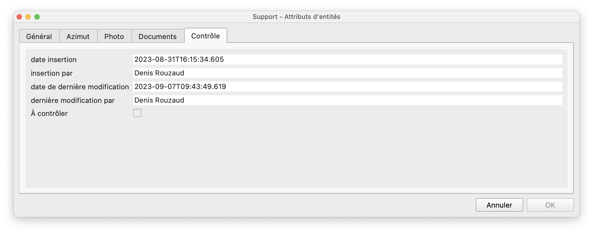

# Ajout de signaux

* Mettre la couche "Support" en édition et digitaliser un point pour ouvrir le formulaire.

!!! info "Le formulaire est composé de cinq onglets:"

    === "Général"
        {loading=lazy}

    === "Azimut"
        {loading=lazy}

    === "Photo"
        {loading=lazy}

    === "Documents"
        {loading=lazy}

    === "Contrôle"
        {loading=lazy}

## Onglet Azimut
Dans l’onglet “Azimut”, les cadres et signaux peuvent y être saisis. L'attribut *Azimut* peut être rempli de manière graphique, grâce à la vue `vw_azimut_edit` (couche Outil Azimut) du schéma `signalo_app`. 
Le catalogue des signaux officiaux peut être téléchargé en [pdf](https://www.signalo.ch/user-guide/concepts/#liste-des-signaux).

## Onglet Documents
Dans l'onglet “Documents“, des fichiers de tout format peuvent être liés à un support à travers leur chemin de stockage. L'extension [Document Management System](https://plugins.qgis.org/plugins/document_management_system/) fournit une interface pour gérer les relations du système de gestion des documents des deux côtés (côté document et côté support). Elle prend en charge les relations 1-N et N-M. Les chemins vers les documents sont stockés dans la base de données dans la table `signalo_db.dms_document`.

## Onglet Contrôle
L'onglet "Contrôle" comporte des métadonnées sur les dernières modifications et si le support nécessite une validation des données modifiées. Voir aussi le chapitre [Validation des changements](https://signalo.ch/user-guide/validation/) pour les instructions détaillées.
