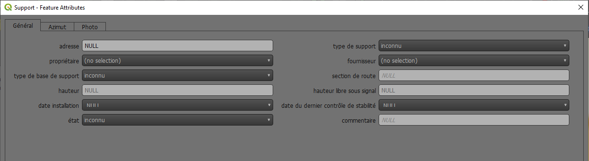
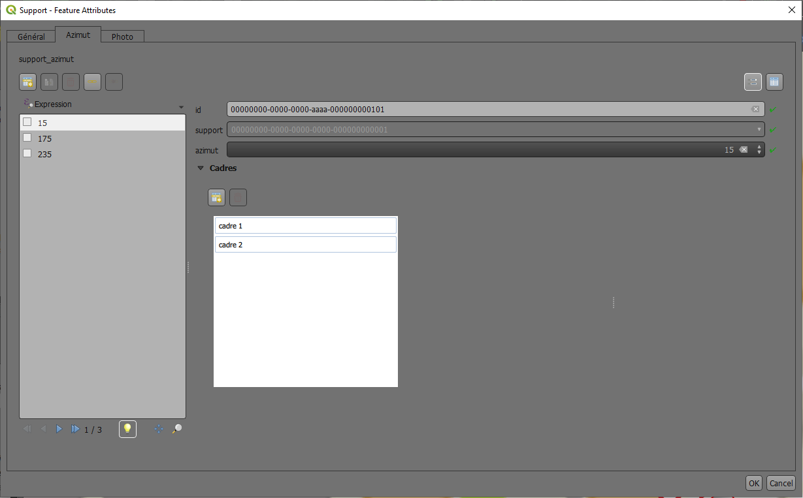
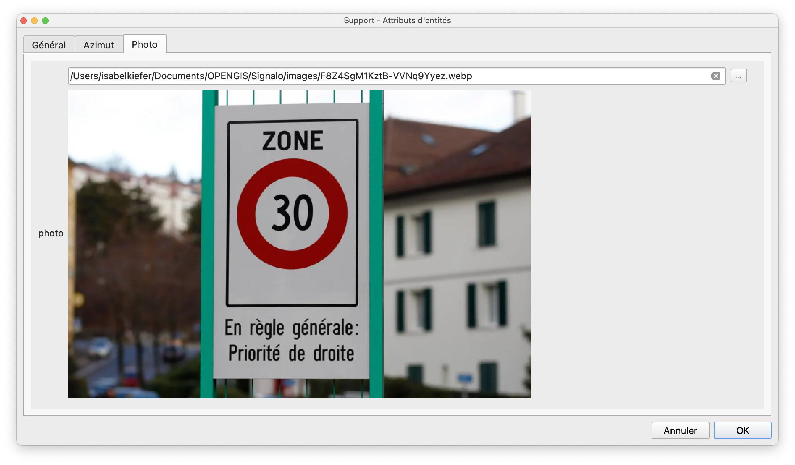
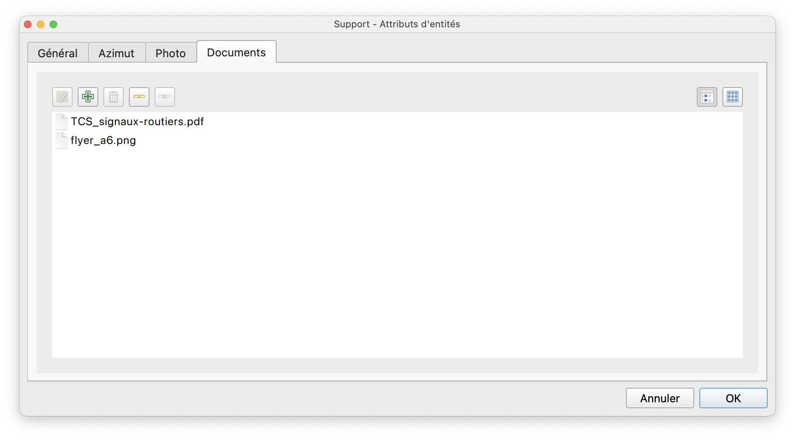
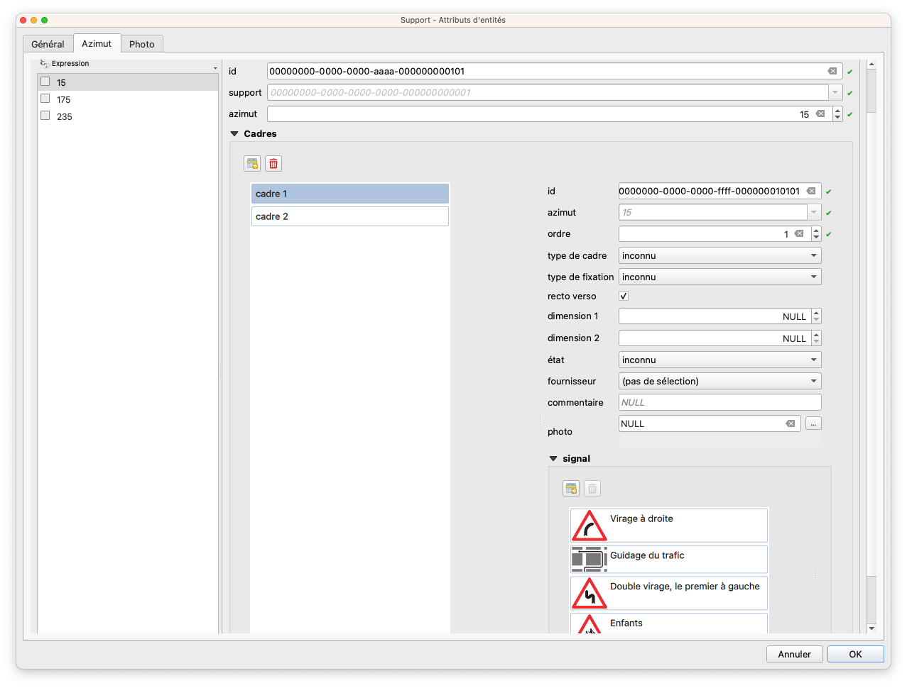
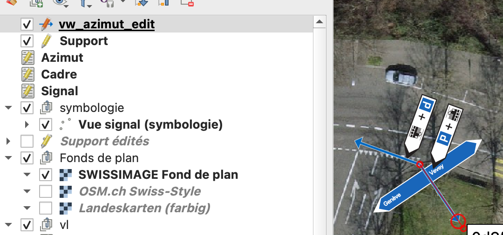

# Edition

## Ajout de signaux

* Mettre la couche "Support" en édition et digitaliser un point pour ouvrir le formulaire.

!!! info "Le formulaire est composé de quatre onglets:"

    === "Général"
        {loading=lazy}

    === "Azimut"
        {loading=lazy}

    === "Photo"
        {loading=lazy}

    === "Documents"
        {loading=lazy}

Dans l’onglet “Azimut”, les cadres et signaux peuvent y être saisis. L'attribut *Azimut* peut être rempli de manière graphique, grâce à la vue `vw_azimut_edit` (couche Outil Azimut) du schéma `signalo_app`.

<figure markdown>
  
  <figcaption>Exemple d'un azimut avec plusieurs cadres et signaux</figcaption>
</figure>

<figure markdown>
  
  <figcaption>Définition de l'azimut de manière graphique, grâce à l'outil</figcaption>
</figure>

Dans l'onglet “Documents“, des fichiers de tout format peuvent être liés à un support à travers leur chemin de stockage. L'extension [Document Management System](https://plugins.qgis.org/plugins/document_management_system/),fournit une interface pour gérer les relations du système de gestion des documents des deux côtés (côté document et côté objet). Elle prend en charge les relations 1-N et N-M. Les chemins vers les documents sont stockés dans la base de données dans la table `signalo_db.dms_document`.
