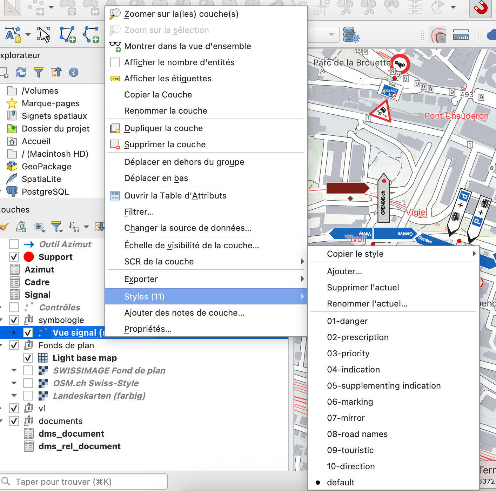
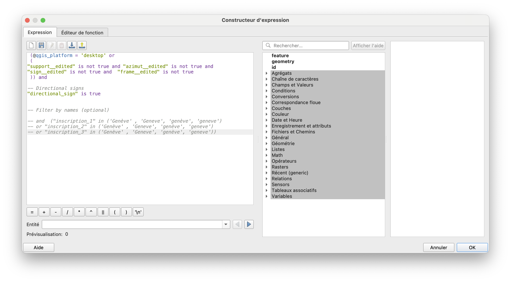

# Filtrage et analyse de la cohérence globale

Cette fonctionnalité devrait être [améliorée](../../roadmap.md) dans les versions suivantes.

Il est possible de filtrer l'affichage des panneaux en changeant le style de la couche "Vue signal (symbologie)".
Avec un clic-droit sur la couche, sélectionner "Style" dans le menu et choississez le style souhaité. Par défaut, le style "default" est activé, montrant tous les panneaux. 

{width="400"; loading=lazy; style="max-width: 900px"}

Le filtre est défini dans l'expression de la règle de la symbologie. Le style '10-direction' du filtre pour les panneaux directionnels contient un exemple de filtrage par inscription (voir capture d'écran ci-dessous). Celui-ci permet d'examiner visuellement la cohérence de signaux saisis. 

{width="400"; loading=lazy; style="max-width: 900px"}

> A noter : Ce type de filtre détermine uniquement quels signaux sont visibles sur la carte. Le rang d’affichage n’est pas mis à jour en conséquence, ce qui peut entraîner des espaces « vides » entre le support et le panneau affiché, lorsque des panneaux de types différents, ayant des rangs inférieurs à ceux affichés par le filtre, sont présents.