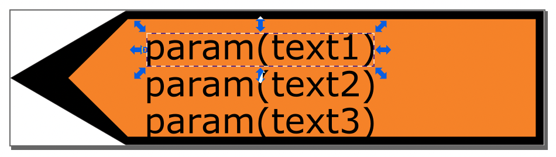

# Signaux définis par l'utilisateur

Il arrive qu'une certaine composition de signaux sur un même panneau n'existe pas dans la sélection des signaux officiels.

## Remplir la base de données
La table `vl_user_sign` (couche *Signal défini par l'utilisateur* dans QGIS) permet la création de signaux personnalisés. Cette table contient les mêmes attributs que `vl_official_sign`, la liste des signaux officiels. Les attributs peuvent être renseignés soit directement dans la base de données via pgAdmin, soit dans le projet QGIS. Au minimum, les attributs suivants doivent être renseignés:

* `id` - identifiant unique qui sera utilisé dans la liste déroulante dans QGIS
* `active` - à mettre sur *true*, autrement le signal n'apparaîtra pas dans la liste déroulante dans QGIS
* `value_fr`, ou `value_de` ou `value_it`, en fonction de la langue utilisateur - ce nom apparaîtra également dans la liste déroulante dans QGIS
* `img_fr` ou `img_de` ou `img_it`, en fonction de la langue de l'utilisateur. Cet attribut doit contenir le nom exact du fichier `.svg` du signal personnalisé
* `img_height` et `img_width` - deux valeurs qui contiennent la hauteur et la largeur de l'image `.svg`

Les attributs suivants permettent en outre de créer et gérer des panneaux directionnels personnalisés:

* `directional_sign` - à mettre sur *true* s'il s'agit d'un panneau directionnel
* `img_fr_right`, `img_de_right`, `img_it_right`, `img_ro_right`, qui contiendront le nom du fichier `.svg` avec direction à droite, par exemple *composite-r.svg*. Les attributs `img_fr`, `img_de` etc. contiendront alors le nom du fichier `.svg` avec direction à gauche, par exemple *composite-l.svg*.

Il est possible de créer des signaux statiques ou dynamiques. Le signal dynamique permet d'avoir une base de signal personnalisé qui est en plus dynamique par rapport au texte à afficher.
L'attribut `no_dynamic_inscription` devrait contenir le nombre de textes dynamiques dans le `.svg` (ce qui équivaut au nombre de lignes). Cette information doit être renseignée manuellement.

## Création du symbol à afficher sur la carte
La création du `.svg` correspondant est donc dans la responsabilité de l'utilisateur. Le fichier d'image doit être enregistré dans les deux dossiers

* `project/images/user-defined/original` : ceci est l'image non-dynamique qui sera aussi affichée dans le formulaire d'attributs. Cette image doit contenir un text static d'exemple.
* `project/images/user-defined/editable` : ceci est l'image dynamique qui permet d'afficher des inscriptions dynamiques.

> A noter: Il est recommandé de reprendre un des fichiers d'images officielles (`project/images/official/original` et `/éditable`) **comme exemple et base** pour créer un signal personnalisé, afin d'avoir une idée de la taille et pour comprendre comment configurer les inscriptions dynamiques.

<figure markdown>
  {width="200"; loading=lazy; style="max-width: 900px"}
  <figcaption>Emplacement des fichiers `.svg` des signaux définis par l'utilisateur</figcaption>
</figure>

### Signaux dynamiques
Les fichiers `.svg` éditables (dynamiques) contiennent des objets texte `param(text1)`, `param(text2)`, `param(text3)` en fonction du nombre de lignes à afficher sur le signal. Ce texte est défini via le projet QGIS, dans les champs `inscription_1`, `inscription_2` et `inscription_3` du formulaire d'attribut du signal.  
Le nombre de lignes d'inscriptions dynamiques est limité à 3 au maximum.  

Le `.svg` dynamique ne laisse pas beaucoup d'options de formatage. Le texte sera toujours affiché à partir de là où commence le champs texte `param(text)`. Il n'est donc pas possible de centrer le texte dynamique sur le signal.

<figure markdown>
  {width="400"; loading=lazy; style="max-width: 900px"}
  <figcaption>Exemple de signal dynamique</figcaption>
</figure>

### Signaux statiques
Si le signal personnalisé ne doit pas contenir d'inscription dynamique, les fichiers dans les dossiers `user-defined/original` et `user-defined/editable` peuvent être les mêmes.  

## Utilisation dans le projet QGIS
Afin d'accéder à la liste déroulante des signaux définis par l'utilisateur dans QGIS, le **type de signal** *défini par l'utilisateur* doit être choisi.

