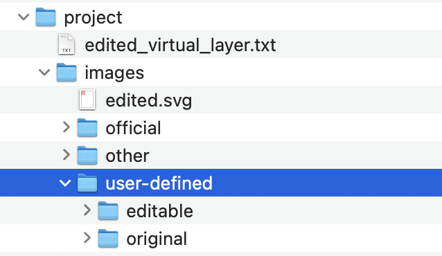

# Signaux définis par l'utilisateur

Il arrive qu'une certaine composition de signaux sur un même panneau n'existe pas dans la sélection des signaux officiels. La table `vl_user_sign` (couche *Signal défini par l'utilisateur* dans QGIS) permet la création de signaux personnalisés. Cette table contient les mêmes attributs que `vl_official_sign`, la liste des signaux officiels. Au minimum, les attributs suivants doivent être renseignés:

* `id` - identifiant unique qui sera utilisé dans la liste déroulante dans QGIS
* `active` - à mettre sur *true*, autrement le signal n'apparaîtra pas dans la liste déroulante dans QGIS
* `value_fr`, ou `value_de` ou `value_it`, en fonction de la langue utilisateur - ce nom apparaîtra également dans la liste déroulante dans QGIS
* `img_fr` ou `img_de` ou `img_it`, en fonction de la langue de l'utilisateur. Cet attribut doit contenir le nom exact du fichier `.svg` du signal personnalisé
* `img_height` et `img_width` - deux valeurs qui contiennent la hauteur et la largeur de l'image `.svg`

Les attributs suivants permettent en outre de créer et gérer des panneaux directionnels personnalisés:

* `directional_sign` - à mettre sur true s'il s'agit d'un panneau directionnel
* `img_fr_right`, `img_de_right`, `img_it_right`, `img_ro_right`, qui contiendront le nom du fichier `.svg` avec direction à droite, par exemple *composite-r.svg*. Les attributs `img_fr`, `img_de` etc. contiendront alors le nom du fichier `.svg` avec direction à gauche, par exemple *composite-l.svg*.

L'attribut `no_dynamic_inscription` devrait contenir le nombre de textes dynamiques dans le `.svg` (ce qui équivaut au nombre de lignes). Cette information doit être renseignée manuellement.

Afin d'accéder à la liste déroulante des signaux définis par l'utilisateur dans QGIS, le **type de signal** *défini par l'utilisateur* doit être choisi.

<figure markdown>
  
  <figcaption>Liste des types de signal</figcaption>
</figure>

La création du `.svg` correspondant est donc dans la responsabilité de l'utilisateur. Le fichier d'image doit être enregistré dans les deux dossiers

* `project/images/user-defined/original` : ceci est l'image non-dynamique qui sera aussi affichée dans le formulaire d'attributs. Cette image doit contenir un text static d'exemple.
* `project/images/user-defined/editable` : ceci est l'image dynamique qui permet d'afficher des inscriptions

> A noter: Il est recommandé de reprendre un des fichiers d'images officielles (`project/images/official/original` et `/éditable`) **comme exemple et base** pour créer un signal personnalisé, afin d'avoir une idée de la taille et pour comprendre comment configurer les inscriptions dynamiques.

Si le signal personnalisé ne doit pas contenir d'inscription dynamique, les fichiers dans les dossiers `user-defined/original` et `user-defined/editable` peuvent être les mêmes.  

<figure markdown>
  {width="200"; loading=lazy; style="max-width: 900px"}
  <figcaption>Emplacement des fichiers `.svg` des signaux définis par l'utilisateur</figcaption>
</figure>
