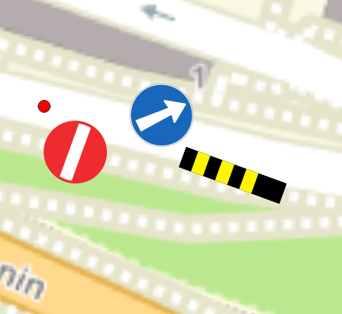

# Grouper par ancrage

Par défaut, la case "grouper par ancrage" au niveau du support est activée (champ `support.group_by_anchor` = `true`). Ceci regroupe les signaux visuellement sur la carte, en fonction de leur accrochage (gauche, droite, centre), pour chacun des azimuts. Quand l'ordre des signaux sur la carte doit suivre l'ordre donné dans le formulaire, cette case doit être décochée. 

{width="400"; loading=lazy; style="max-width: 900px"}

{width="400"; loading=lazy; style="max-width: 900px"}
