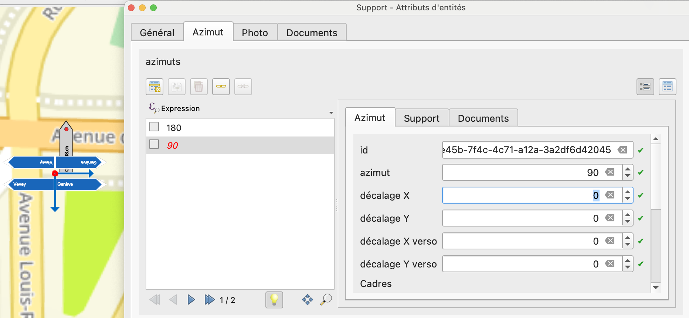
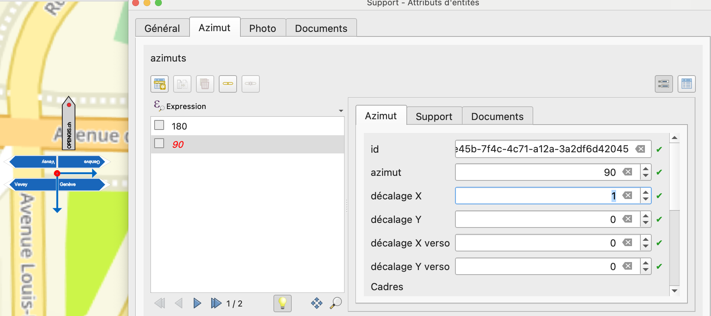

# Décalage des panneaux

En cas de supports portant de nombreux signaux, la visibilité des signaux sur la carte peut être améliorée avec les attributs `offset_x` et `offset_y` de la table `azimut` (attributs *décalage X* et *décalage Y* de la couche *Azimut* dans QGIS). Pour les versos, les attributs `offset_x_verso`et `offset_y_verso` (*décalage X verso* et *décalage Y verso*) peuvent être utilisés.

{width="400"; loading=lazy; style="max-width: 900px"}

{width="400"; loading=lazy; style="max-width: 900px"}
