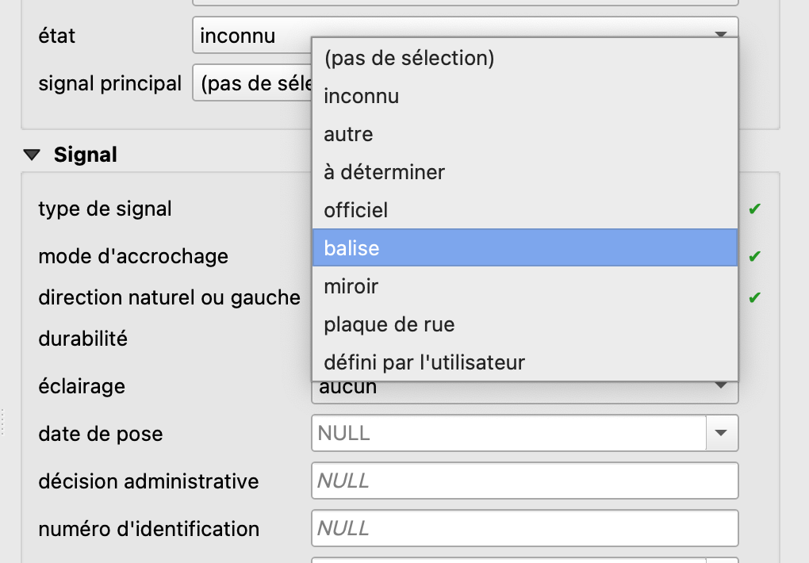
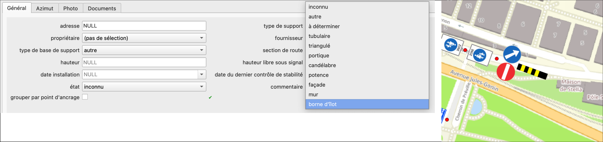

# Balises
## Balises et balisages

Les balises sont gérées comme une catégorie de signaux à part. Tout comme les signaux officiels et les signaux définis par l'utilisateur, une liste de valeurs spécifique (`vl_marker_type`) existe pour les balises. L'accès aux valeurs dans cette liste se fait en choisissant *balises* dans la liste déroulante **type de signal** de la couche *Signal*.

{width="300"; loading=lazy; style="max-width: 900px"}

Les images `.svg` des balises sont stockées dans `project/images/marker/editable` et `... original`.

Les types de balises suivants sont directionnels et traités dans le projet QGIS exactement comme les [panneaux directionnels](https://signalo.ch/user-guide/directionalsigns/):  

- Flèche de balisage simple
- Flèche de balisage multiple
- Balise de guidage (direction).

## Bornes d'îlot
Les bornes d'îlot ne sont pas définies au niveau du type de signal (*balises*), mais avec le type de support *borne d'îlot*. Sur la carte s'affichera donc une borne en jaune et noire.

<figure markdown>
  {width="600"; loading=lazy; style="max-width: 900px"}
  <figcaption>Type de support: borne d'îlot</figcaption>
</figure>
