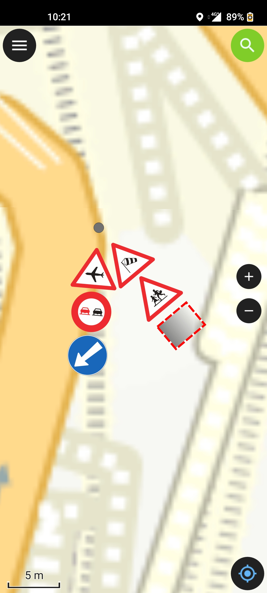
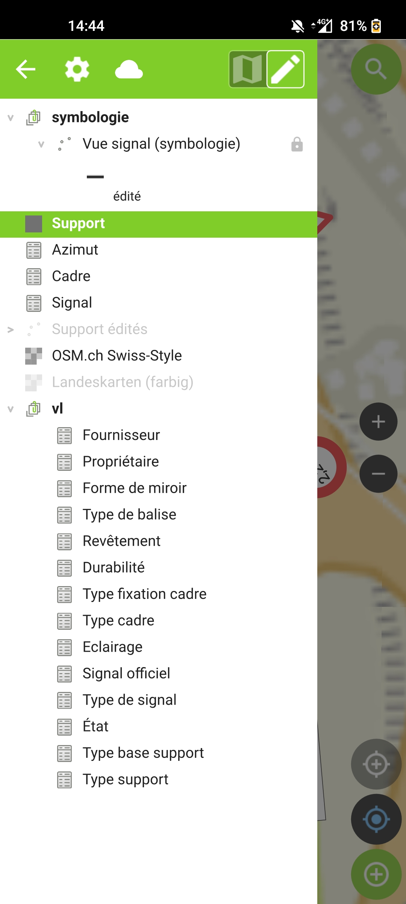
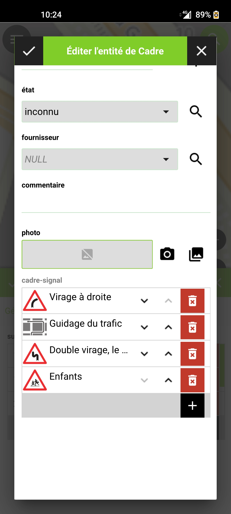

Pour le travail de terrain, l'application mobile [**QField**](https://qfield.org/) et l'extension pour QGIS [**QFieldSync**](https://plugins.qgis.org/plugins/qfieldsync/) sont utilisées.

Nous renvoyons ici vers la [documentation de QField](https://docs.qfield.org/get-started/) pour les étapes de préparation du projet de terrain.

!!! info "Édition sous QField"

    === "Carte"
          { width="300" align="left"; loading=lazy }

    === "Légende"
          { width="300" align="left"; loading=lazy }

    === "Formulaire d'attribut"
          { width="300" align="left"; loading=lazy }

!!! info "Symbologie hors ligne"

    Le positionnement des signaux sur la carte (empilement, recto/verso, décalages) est calculé par une vue de la base de données, qui n'est pas accessible sur le terrain.

    Le projet embarque donc une couche virtuelle **Vue signal (symbologie hors ligne)** qui rejoue ce calcul directement sur les couches emportées hors ligne. Les signaux ajoutés, supprimés ou réordonnés sur le terrain sont donc repositionnés immédiatement dans QField.

    Cette couche n'existe que dans le paquet : elle est construite au moment de l'empaquetage à partir de la couche PostgreSQL **Vue signal (symbologie)**, qui reste la seule couche de symbologie du projet de bureau. La symbologie ne se modifie donc qu'à un seul endroit.

    **Le paquet doit être construit avec le script ci-dessous.** Un paquet créé directement depuis la boîte de dialogue QFieldSync ne contient pas la couche hors ligne, et l'affichage des signaux y reste figé.

!!! tip "Paquet de terrain automatisé"

    Le projet de terrain est également construit automatiquement à chaque publication : l'archive **`signalo-qfield-package.zip`** est jointe aux [releases](https://github.com/opengisch/signalo/releases) et peut être utilisée telle quelle.

    Elle est produite sans intervention manuelle, puis contrôlée : la couche de symbologie hors ligne est présente et valide, la couche PostgreSQL a bien été retirée, aucune donnée n'a été perdue et l'ajout d'un signal repositionne effectivement les symboles.

    Pour la construire localement, ou pour vérifier un paquet créé à la main avec QFieldSync :

    ```sh
    docker compose --profile qgis run --rm -e QT_QPA_PLATFORM=offscreen qgis \
      /usr/src/project/scripts/package-qfield.py \
      /usr/src/project/signalo.qgs /usr/src/qfield-package

    docker compose --profile qgis run --rm -e QT_QPA_PLATFORM=offscreen qgis \
      /usr/src/project/scripts/check-qfield-package.py /usr/src/qfield-package/signalo.qgs
    ```
