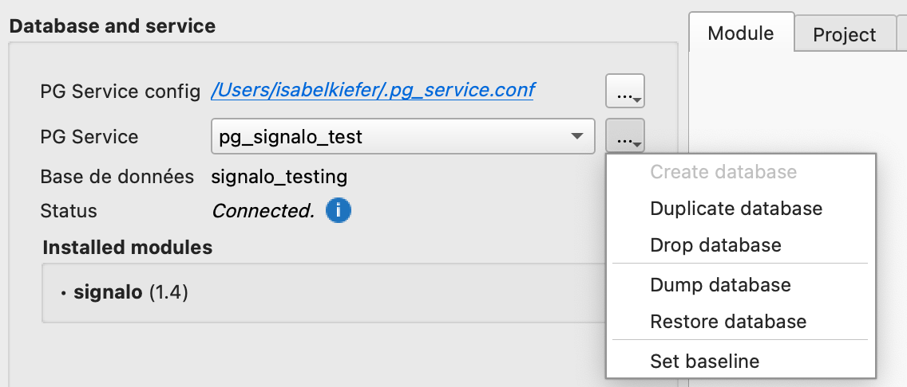

# Mise à jour du modèles de données

La structure des données peut évoluer d'une release à une autre. 

## Mise à jour facilitée
Pour une mise à jour facilitée, suivez le processus d'[upgrade](https://opengisch.github.io/oqtopus/usage/module/upgrade/) avec le plugin [oQtopus](https://plugins.qgis.org/plugins/oqtopus/) pour mettre à jour votre base de données.  

> Il est recommandé de commencer par un test de la nouvelle version en travaillant sur une base de données test. 
> Si cette dernière n'existe pas encore, elle peut être créée facilement en dupliquant une base de données existante dans le dialogue `Database and service` du plugin oQtopus.

{width="350"; loading=lazy; style="max-width: 900px"}

## Mise à jour manuelle
Les mises à jour peuvent être faites manuellement grâce aux fichiers de migration `sql`. Ainsi, la structure est actualisée sans modification des données existantes.

1. Avant de procéder à la mise à jour, faire un backup de la base de données
2. Télécharger les changelogs et le fichier application (`signalo-1.X.Y-db-app.sql`) sur la page de la [release](https://github.com/opengisch/signalo/releases/latest)
3. Supprimer l'application: `psql -c "DROP SCHEMA signalo_app CASCADE"`
4. Lancer les différents scripts SQL de migration: `psql -v ON_ERROR_STOP=1 -v SRID=2056 -f datamodel/changelogs/XXXX/XXXX_zzzzzz.sql` (pour chaque fichier)
5. Recréer l'application avec le ficher SQL de la release: `psql -v ON_ERROR_STOP=1 -f signalo-1.X.Y-db-app.sql`

